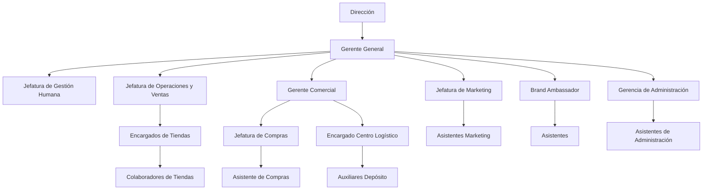

# NEXT STEP

## Caso de Negocio y relevamiento organizacional - IBER

**Transformación digital**

| Campo | Detalle |
|---|---|
| Organización | IBER |
| Equipo | Equipo 3 |
| Sponsor | Sebastián Pensado |
| Entrega / Iteración | Sprint 1 |
| Fecha | 03/09/2026 |

> **Actuación Profesional del Licenciado en Sistemas de Información**  
> Facultad de Ciencias Económicas - Universidad de Buenos Aires

## Equipo de proyecto

| Integrante | Rol en el proyecto |
|---|---|
| Esteban de Nardo | Technology Consultant |
| Macarena Ignacio | [Completar] |
| Juan José Torres | [Completar] |
| Facundo Maggio | [Completar] |
| Tiago Nakasone | [Completar] |
| Santiago Martínez | [Completar] |

### Sponsor / contacto de la organización

- Sebastián Pensado
- Gerente Comercial
- Spensado@iber.uy

## Índice

- [Perfil de la organización](#perfil-de-la-organización)
  - [1. Presentación del caso](#1-presentación-del-caso)
  - [2. Identidad organizacional](#2-identidad-organizacional)
  - [3. Estructura y presencia](#3-estructura-y-presencia)
  - [4. Productos, servicios, clientes y proveedores](#4-productos-servicios-clientes-y-proveedores)
- [Contexto estratégico](#contexto-estratégico)
  - [5. Objetivos estratégicos](#5-objetivos-estratégicos)
  - [6. Contexto competitivo y modelos de negocio del sector](#6-contexto-competitivo-y-modelos-de-negocio-del-sector)
- [Diagnóstico](#diagnóstico)
  - [7. Problemática actual y oportunidades](#7-problemática-actual-y-oportunidades)
  - [8. Diagnóstico de madurez organizacional](#8-diagnóstico-de-madurez-organizacional)
  - [9. Cultura, liderazgo y capacidades](#9-cultura-liderazgo-y-capacidades)
- [Requerimientos iniciales](#requerimientos-iniciales)
  - [10. Historias de usuario](#10-historias-de-usuario)
  - [11. Priorización](#11-priorización)
- [Observaciones del equipo](#observaciones-del-equipo)

# Perfil de la organización

## 1. Presentación del caso

IBER es una empresa uruguaya dedicada al retail especializado de vinos, bebidas alcohólicas y productos gourmet. La organización cuenta con aproximadamente 100 empleados y posee una trayectoria de 30 años de operación en el mercado uruguayo, con un alcance nacional y presencia en distintas localidades del país, complementada por su canal de venta online.

Su modelo de negocio combina la comercialización de productos nacionales e importados y una estrategia multicanal que le permite atender tanto al consumidor final como a otros segmentos del mercado.

## 2. Identidad organizacional

**Misión:** IBER tiene como propósito consolidarse como una empresa líder en el mercado uruguayo, orientada a la satisfacción de sus clientes y consumidores mediante la calidad de sus productos y la excelencia en el servicio. Busca constituirse como una alternativa de consumo accesible para el mercado, estableciendo vínculos con el estilo de vida y las necesidades de la sociedad en la que desarrolla sus actividades.

**Visión:** IBER busca consolidarse como una empresa líder, joven, sólida e innovadora en la comercialización de vinos, espirituosas, productos gourmet y otras especialidades, dirigida a un público amplio. Para ello, busca generar la lealtad de sus consumidores mediante sus acciones diarias y construir relaciones de largo plazo con sus clientes, entendiendo que el crecimiento de sus clientes también contribuye al crecimiento de la organización.

**Valores:** Los valores de IBER se estructuran principalmente en torno a dos pilares: pasión y compromiso. A partir del relevamiento realizado y de las conversaciones mantenidas con el sponsor, el equipo identifica además los siguientes valores asociados a la cultura y forma de trabajo de la organización:

- Orientación al cliente
- Calidad
- Profesionalismo
- Confianza
- Conocimiento del producto
- Innovación
- Trabajo en equipo
- Eficiencia operacional

## 3. Estructura y presencia

### Organigrama

A continuación, se presenta el organigrama de IBER, elaborado a partir de la información relevada durante las conversaciones con el sponsor, con el objetivo de representar las principales áreas y niveles de responsabilidad de la organización.

### Alcance geográfico

IBER posee un alcance nacional dentro de Uruguay, con presencia en distintos departamentos y localidades del país. La organización cuenta con establecimientos en Montevideo, Las Piedras, Ciudad de la Costa, Salto, Paysandú, Mercedes, Colonia, Minas y Punta del Este, además de contar con un canal de venta online.

Su distribución geográfica implica una operación descentralizada, con múltiples puntos de venta y un centro logístico que abastece a los distintos establecimientos. Esta característica resulta relevante para el análisis del proyecto, dado que genera una mayor complejidad en la gestión de los traslados y la logística interna.

## 4. Productos, servicios, clientes y proveedores

IBER se dedica principalmente a la comercialización de vinos, bebidas alcohólicas y productos gourmet, tanto nacionales como importados. También ofrece servicios vinculados a la experiencia y asesoramiento en la compra de vinos.

### Productos y servicios

- Vinos y espumantes nacionales e importados.
- Whiskies y otras bebidas espirituosas.
- Cervezas.
- Productos gourmet.
- Accesorios relacionados con el consumo de bebidas.
- Degustaciones, catas y actividades vinculadas al vino.
- Asesoramiento especializado en los distintos canales de venta.

### Clientes

La empresa trabaja con diferentes segmentos:

- Consumidor final, mediante locales físicos y canal digital.
- Clientes corporativos, principalmente para regalos empresariales.
- Restaurantes y otros clientes del canal HORECA.
- Vinotecas y clientes mayoristas.
- Clientes ocasionales o turistas en determinados puntos de venta.

### Proveedores y cadena de valor

IBER trabaja con bodegas y proveedores nacionales e internacionales, además de proveedores de productos gourmet y servicios relacionados con la operación.

La cadena de valor incluye principalmente:

A esto se suman servicios de transporte, operadores logísticos, medios de pago y otros proveedores que intervienen en la comercialización y distribución de los productos.

# Contexto estratégico

## 5. Objetivos estratégicos

A partir del relevamiento realizado junto al sponsor, se identificaron los siguientes objetivos estratégicos vinculados principalmente con la digitalización y optimización de la gestión logística de IBER. Estos objetivos buscan mejorar la trazabilidad de las operaciones, optimizar los costos de distribución y reducir la dependencia de procesos manuales.

| Objetivo estratégico | Indicador | Meta | Plazo |
|---|---|---|---|
| Digitalizar transferencias de mercaderías entre depósito y locales. | % de transferencias de mercadería registradas | >99% de las transferencias registradas | 2026 Q4 |
| Automatizar la selección del proveedor logístico más conveniente según el destino, volumen, urgencia y costo. | % de envíos con proveedor recomendado automáticamente | >90% de los envíos totales | 2026 Q4 |
| Registrar en el ERP los principales hitos de cada envío. | % de envíos con registro de preparación, despacho, tránsito y entrega | >99% de los envíos totales | 2026 Q4 |
| Identificar el costo logístico total de cada pedido. | % de pedidos con costo logístico total calculado | >99% de los envíos totales | 2026 Q4 |
| Automatizar la generación de solicitudes de reposición entre el depósito central y los locales. | % de reposiciones generadas mediante reglas automáticas | >90% del total de órdenes de reposición | 2027 Q1 |
| Reducir el costo promedio de distribución por pedido. | Costo logístico promedio por pedido | Reducción del 20% del costo actual | 2027 Q1 |

**Interpretación del equipo:** Los objetivos identificados presentan una orientación común hacia la digitalización, automatización y optimización de la operación logística. Los objetivos con plazo 2026 Q4 se concentran en obtener visibilidad y control sobre los envíos, mientras que los previstos para 2027 Q1 apuntan a una segunda etapa de optimización, vinculada con la automatización de reposiciones y la reducción de costos.

### Arquitectura de negocio

[Completar en la iteración correspondiente.]

### Arquitectura de sistemas de información

[Completar en la iteración correspondiente.]

### Arquitectura tecnológica

[Completar en la iteración correspondiente.]

### Visión de la solución

[Vista integrada del estado destino.]

## 6. Contexto competitivo y modelos de negocio del sector

La organización se encuentra dentro del sector de retail especializado de bebidas alcohólicas y productos gourmet, con una participación particularmente relevante en el segmento de vinos. El mercado uruguayo presenta distintos modelos de comercialización que conviven y compiten entre sí: importadores y distribuidores, cadenas de supermercados, tiendas especializadas, comercios gourmet, canal gastronómico (HORECA) y plataformas de comercio electrónico.

Dentro de este mercado, la comercialización de vinos presenta una particularidad: existe una amplia oferta de productos de origen nacional, pero también una presencia significativa de vinos provenientes de Argentina, Chile, Europa y otros mercados. La actividad de importación agrega complejidad al negocio, ya que involucra procesos de adquisición internacional, ingreso de mercadería, almacenamiento, distribución y posterior comercialización. INAVI, por ejemplo, establece procesos específicos para la importación de vinos, incluyendo documentación, extracción de muestras y controles previos a su liberación.

En este contexto, Iber presenta una posición diferenciada dentro del retail especializado uruguayo, sustentada principalmente en la amplitud de su catálogo, la comercialización de productos importados, la presencia física en distintos puntos del país y la combinación de canales físicos y digitales. Actualmente cuenta con múltiples formatos de tiendas y presencia en Montevideo, el interior y Punta del Este, además de su canal de venta online.

La competencia de la organización no se limita, por lo tanto, a otras vinotecas. También incluye a supermercados y grandes superficies, que compiten principalmente mediante volumen, promociones y convenios comerciales; a importadores y distribuidores, que compiten por marcas, precios y cobertura; y a tiendas especializadas y canales digitales, que compiten mediante variedad, asesoramiento, conveniencia y experiencia de compra.

Una de las principales transformaciones del sector es el crecimiento del canal digital y de las expectativas asociadas a la experiencia de compra. El comercio electrónico uruguayo viene mostrando un crecimiento sostenido: las ventas online alcanzaron aproximadamente US$ 1.563 millones durante 2024, con un crecimiento del 38% respecto de 2023, mientras que durante el primer semestre de 2025 continuaron creciendo. Esto genera mayores exigencias sobre aspectos como disponibilidad de stock, velocidad de preparación, seguimiento de pedidos y cumplimiento de los plazos de entrega.

A su vez, el mercado presenta una mayor transparencia de precios, impulsada por la posibilidad de comparar productos y promociones entre distintos canales. Las empresas deben competir no solamente mediante descuentos, sino también mediante variedad, disponibilidad, servicio, fidelización, asesoramiento y experiencia de compra.

En este escenario, la ventaja competitiva de Iber no depende únicamente de la amplitud de su oferta, sino también de su capacidad para gestionar eficientemente una operación cada vez más omnicanal y distribuida geográficamente. La expansión de los canales de venta y de la red de establecimientos incrementa, a su vez, la complejidad de las operaciones de distribución y última milla.

Por lo tanto, se identifica una oportunidad de mejora vinculada a la digitalización e integración de la gestión logística, de forma que la infraestructura tecnológica acompañe el crecimiento y la propuesta de valor de la organización.

# Diagnóstico

## 7. Problemática actual y oportunidades

Iber cuenta con una operación logística compleja debido a la diversidad de sus canales de venta, su distribución geográfica y la utilización de diferentes modalidades de transporte. La empresa gestiona envíos desde el centro logístico hacia tiendas y depósitos, entregas a clientes HORECA, e-commerce, clientes corporativos y clientes finales, además de movimientos internos entre tiendas.

Actualmente, la gestión de estos envíos se realiza mediante procesos mayormente manuales y sin una integración completa con el ERP. La planificación de rutas, asignación de fleteros, seguimiento de entregas, gestión de autorizaciones y registro de costos requieren una importante intervención manual.

A partir del relevamiento realizado, identificamos como principales problemáticas:

- Falta de integración entre la gestión logística y el ERP.
- Baja trazabilidad del estado y recorrido de los envíos.
- Dificultad para planificar y asignar eficientemente los servicios de transporte.
- Falta de información consolidada sobre costos y desempeño logístico.
- Ausencia de reportes automáticos para el control y la toma de decisiones.
- Procesos de autorización y control poco sistematizados.

### Diagnóstico

El equipo identifica como problemática central la falta de un sistema de gestión logística integrado al ERP que permita centralizar, automatizar y controlar el ciclo completo de los envíos.

Esta situación genera una brecha entre la complejidad actual de la operación logística de Iber y el nivel de soporte que brinda su sistema de información, generando dependencia de procesos manuales, menor visibilidad de la operación y dificultades para controlar y optimizar los costos.

### Oportunidad

La principal oportunidad consiste en integrar la gestión logística al ERP, permitiendo planificar y asignar envíos, gestionar proveedores y fleteros, realizar el seguimiento de cada operación, registrar autorizaciones, imputar costos y generar información para el control y la toma de decisiones.

## 8. Diagnóstico de madurez organizacional

Se considera que la organización presenta un nivel de madurez general **3 - Definido**, aunque existen diferencias entre las distintas áreas y procesos. La organización cuenta con procesos establecidos y una estructura operativa consolidada, pero la gestión logística presenta un menor nivel de madurez debido a la utilización de procesos manuales, falta de integración con el ERP, baja trazabilidad y ausencia de reportes automáticos.

En particular, el proceso logístico presenta características cercanas al nivel **2 - Repetible**, dado que existen prácticas operativas conocidas, pero con una importante dependencia de la intervención manual y de las personas responsables de cada operación.

La principal oportunidad consiste en avanzar hacia un nivel **4 - Administrado**, incorporando indicadores, automatización, trazabilidad e información centralizada para la toma de decisiones.

### Análisis del mercado

[Contexto, alternativas existentes y criterios utilizados.]

### Criterios de evaluación

[Completar en la iteración correspondiente.]

### Solución elegida

[Completar en la iteración correspondiente.]

### Comparación de resultados

[Completar en la iteración correspondiente.]

## 9. Cultura, liderazgo y capacidades

IBER presenta una cultura organizacional dinámica y receptiva a cambios y propuestas de mejora, especialmente cuando estos permiten reducir tiempos, costos y esfuerzos operativos. Sin embargo, se identifica como limitación la ausencia de un liderazgo claramente definido sobre el proceso logístico, lo que dificulta la coordinación y priorización de mejoras.

### Criterios y ponderaciones

[Completar en la iteración correspondiente.]

### Evaluación de alternativas

[Completar en la iteración correspondiente.]

### Escalas de medición

[Completar en la iteración correspondiente.]

### Resultados de factibilidad

[Completar en la iteración correspondiente.]

### Conclusiones de factibilidad

[Completar en la iteración correspondiente.]

# Requerimientos iniciales

## 10. Historias de usuario

### US-01 - Digitalizar transferencias entre depósitos y locales

**COMO:** Gerente Comercial  
**QUIERO:** Contar con información digitalizada de los transportes de mercadería entre depósitos y locales, incluyendo responsable, fechas y tiempos de traslado  
**PARA:** Tener mayor control sobre los traslados y disponer de información ante posibles demoras.

### US-02 - Selección automática del proveedor

**COMO:** Encargado del Centro Logístico  
**QUIERO:** Un proceso automático de selección del proveedor logístico según las características del envío  
**PARA:** Reducir desvíos y optimizar la asignación del transporte.

### US-03 - Trazabilidad de envíos

**COMO:** Encargado del Centro Logístico  
**QUIERO:** Registrar y consultar los distintos hitos del envío con actualización constante  
**PARA:** Consultar y conocer rápidamente la situación de cada envío para mejorar cada entrega.

### US-04 - Costos logísticos

**COMO:** Gerente Comercial  
**QUIERO:** Centralizar en el ERP el cálculo del costo total de cada envío  
**PARA:** Controlar y optimizar los costos logísticos y disponer de información ante reclamos.

### US-05 - Stock y reposición

**COMO:** Gerente Comercial  
**QUIERO:** Establecer niveles máximos y mínimos de stock por producto y tienda  
**PARA:** Mejorar el control de disponibilidad de productos.

### US-06 - Reposición automática

**COMO:** Encargado de tienda  
**QUIERO:** Generar automáticamente solicitudes de reposición entre el depósito central y mi tienda  
**PARA:** Reducir los casos de falta de stock provocados por procesos manuales.

### US-07 - Reportes de gestión

**COMO:** Responsable de Logística  
**QUIERO:** Obtener reportes automáticos sobre la operación logística  
**PARA:** Analizar su desempeño y tomar decisiones basadas en información.

### Costos iniciales / puesta en marcha

[Completar en la iteración correspondiente.]

### Costos recurrentes

[Completar en la iteración correspondiente.]

### Costo total de propiedad / servicio

[Completar en la iteración correspondiente.]

### Resumen económico

[Completar en la iteración correspondiente.]

### Retorno de inversión

[Completar en la iteración correspondiente.]

## 11. Priorización

| ID | Historia de usuario | Prioridad MoSCoW | Justificación |
|---|---|---|---|
| US-01 | Digitalizar transferencias | Must | Es uno de los problemas principales identificados. |
| US-02 | Selección automática de proveedor | Must | Permite optimizar costos y asignación de transporte. |
| US-03 | Trazabilidad de envíos | Must | Es fundamental para controlar el estado de las entregas. |
| US-04 | Costos logísticos | Must | El control de costos es una necesidad explícita del negocio. |
| US-05 | Stock y reposición | Should | Es importante, pero puede desarrollarse después del núcleo logístico. |
| US-06 | Reposición automática | Should | Reduce faltantes, pero depende de una correcta gestión de stock. |
| US-07 | Reportes de gestión | Should | Es importante para la gestión, aunque puede evolucionar después de implementar los datos operativos. |

### Resumen por área de evaluación

[Completar en la iteración correspondiente.]

### Análisis individual

[Completar en la iteración correspondiente.]

### Análisis comparativo

[Completar en la iteración correspondiente.]

### Cashflow comparativo

[Completar en la iteración correspondiente.]

### Justificación de la selección

[Completar en la iteración correspondiente.]

### Evaluación del cumplimiento esperado

[Completar en la iteración correspondiente.]

### Consideraciones

[Completar en la iteración correspondiente.]

### Conclusiones

[Completar en la iteración correspondiente.]

# Observaciones del equipo

- Se identifica:
  - Alta dependencia de procesos manuales dentro de la gestión logística.
  - No hay posibilidad de generar reportes automáticos.
  - Falta de autorizaciones en los procesos.
  - Falta de tecnología en servicio de una mejor experiencia para los clientes.
  - Falta de claridad en la información para controlar y medir los costos y el desempeño.
- La operación presenta una elevada complejidad debido a la cantidad de canales de distribución y puntos geográficos.
- Existe una oportunidad concreta de integración entre la gestión logística y el ERP.
- La ausencia de un liderazgo claramente definido para el proceso logístico puede dificultar la implementación de mejoras.
- La organización presenta una actitud receptiva frente a propuestas de mejora, especialmente cuando permiten reducir tiempos y costos.
- Será necesario profundizar en los próximos sprints sobre los procesos actuales, responsables, sistemas utilizados, reglas de negocio e información requerida.

## Documentación de respaldo

[Completar en la iteración correspondiente.]

## Entrevistas y relevamientos

[Completar en la iteración correspondiente.]

## Diagramas y modelos

[Completar en la iteración correspondiente.]

## Fuentes / referencias

[Completar en la iteración correspondiente.]

## Otros

[Completar en la iteración correspondiente.]
