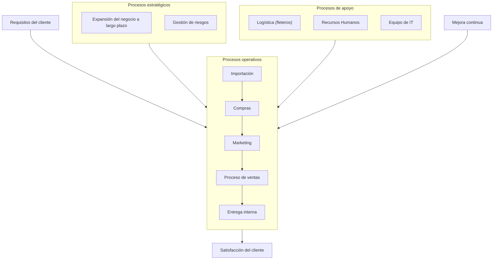

# Arquitectura Empresarial Actual — IBER

**Organización:** IBER  
**Consultora:** Next Step — Consultoría en Tecnología  
**Asignatura:** Actuación Profesional del Licenciado en Sistemas de Información  
**Institución:** Facultad de Ciencias Económicas — Universidad de Buenos Aires

## Arquitectura de negocios

### Mapa de procesos de la organización

> Presentar el mapa de procesos en formato ISO 9001 que refleje la realidad actual, independientemente de cómo se espere que luzca al final del proyecto.

> **Nota de trabajo (Esteban):** Se incorpora el mapa realizado en clase, pero necesita iteraciones y mejoras.

#### Procesos estratégicos

| Proceso | Descripción |
|---|---|
| Expansión del negocio a largo plazo | Definición de objetivos, análisis de mercado, planes de crecimiento y nuevas oportunidades. |
| Gestión de riesgos | Identificación, evaluación y control de riesgos para asegurar la continuidad del negocio. |

#### Procesos operativos

| Orden | Proceso | Descripción |
|---:|---|---|
| 1 | Importación | Gestión de proveedores internacionales y trámites de importación. Comprende el ingreso de productos importados, desde la coordinación con proveedores del exterior hasta su recepción en la empresa. |
| 2 | Compras | Selección de proveedores, negociación y compra de productos. Incluye la adquisición de productos nacionales y la reposición de mercadería necesaria para abastecer los distintos puntos de venta. |
| 3 | Marketing | Investigación de mercado, promoción y comunicación de productos y servicios. Comprende la promoción de productos, marcas y propuestas comerciales de IBER. |
| 4 | Proceso de ventas | Atención al cliente, cotización, negociación y cierre de ventas. Incluye la comercialización de vinos, bebidas y productos gourmet mediante los distintos canales de venta, atendiendo las necesidades de los clientes. |
| 5 | Entrega interna | Preparación y entrega de productos a las áreas internas o a clientes. Comprende la distribución y el traslado de mercadería entre el centro logístico, las tiendas y otros puntos de la organización para garantizar su abastecimiento. |

#### Procesos de apoyo

| Proceso | Descripción |
|---|---|
| Logística (fleteros) | Gestión de transporte, coordinación con fleteros y seguimiento de envíos. |
| Recursos Humanos | Selección, capacitación, desarrollo y bienestar del personal. |
| Equipo de IT | Soporte tecnológico, desarrollo de sistemas y mantenimiento de infraestructura. |

#### Mejora continua

Evaluación del desempeño de los procesos e implementación de mejoras y aprendizaje continuo.

El mapa parte de los **requisitos del cliente** y tiene como resultado esperado la **satisfacción del cliente**.

## Arquitectura de datos

Relevar la arquitectura de los datos de la organización, identificando su distribución —centralizada, distribuida o mixta— y las entidades principales del negocio que aloja.

### Tabla resumen de arquitectura de datos

> **Sugerencia:** No considerar únicamente los repositorios de datos informatizados. Un cuaderno o una planilla de Excel también pueden formar parte de la arquitectura de datos si se utilizan para apoyar los procesos de la organización.

> **Estado:** Arquitectura de datos pendiente de revisión.

| Base de datos | Tipo y tecnología | Entidades principales | Seguridad y acceso | Nombre del almacén | Clasificación | Datos que aloja | Medidas de seguridad |
|---|---|---|---|---|---|---|---|
| Base de datos transaccional | SQL Server | Pendiente | Pendiente | Pendiente | OLTP | Pendiente | Pendiente |
| Registro de proveedores | Excel | Pendiente | Pendiente | Pendiente | No aplica | Pendiente | Pendiente |

## Arquitectura de aplicaciones

Relevar el catálogo de aplicaciones actual, identificar iniciativas en ejecución e informar la cobertura de estas aplicaciones sobre los procesos de negocio.

> **Sugerencia:** El correo electrónico, las redes sociales y las aplicaciones de mensajería, como WhatsApp, también forman parte de la arquitectura de aplicaciones cuando se utilizan para apoyar procesos.

### Tabla resumen de arquitectura de aplicaciones

| Procesos ↓ / Aplicaciones → | Aplicación 1 | Aplicación (…) | Aplicación n |
|---|:---:|:---:|:---:|
| Proceso 1 | ✓ |  | ✓ |
| Proceso (…) |  | ✓ |  |
| Proceso n | ✓ |  |  |

## Arquitectura tecnológica

Relevar la estructura de software y hardware de la compañía, incluida la infraestructura de telecomunicaciones y soporte.

### Tabla resumen de arquitectura tecnológica

| Hardware o servicio | Sistema operativo | Middleware o aplicación | Notas |
|---|---|---|---|
| PC de escritorio | Windows 10 | No aplica | Antigüedad promedio superior a 5 años. |
| Servidor principal | Ubuntu Linux 26.04 | Sistema de Gestión | Adquirido en 2025. Sin soporte. |
| Smartphones | Pendiente | Pendiente | Pendiente |

### Redes

| Red | Proveedor | Seguridad y monitoreo | Notas |
|---|---|---|---|
| Principal | ISP xxx | Firewall del proveedor | Cableada y Wi-Fi. ISP no corporativo. |
| Invitados | ISP xxx | No | Solo Wi-Fi. |
